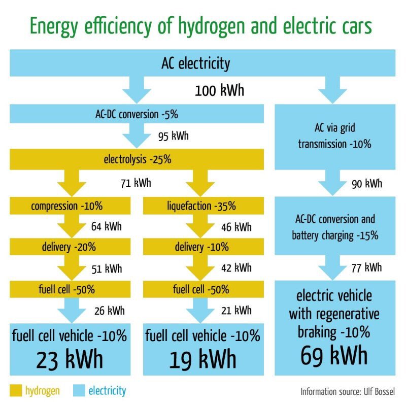

# Energi
## Potentiel energi
Potentiel energi kaldes også beliggenhedsenergi. Energien er afhængig af objektets position i et kraftfelt. På jorden er kraftfeltet tyngdekraften som trækker alle objekter mod centrum af jorden. Den styrke som jorden trækker i genstande afhænger af jordens masse og giver anledning til en acceleration på $g=9,82\text{m/s}^2$.
Et objekt som falder frit mod jorden vil derfor forøge sin fart med $9,82\text{m/s}$ hvert sekund.

### øvelse
* Hvor meget forøges farten med hvert sekund omregnet til km/time? Ved frit fald.

Hvert sekund forøges farten altså med ca. $35\text{km/time}$.

### Regning med enheder
I fysik bruger vi enheder for at vise hvad vi måler. Det giver for en fysiker ikke mening at sige at "temperaturen er 7", for 7 hvad? At temperaturen er "7 grader celcius" er til gængælde en glimrende oplysning, hvis man vil vide om man skal tage en sweater på. På samme måde viser enheden for tyngdeaccelerationen $\text{m/s}^2$ hvordan hastigheden ændrer sig hvert sekund.

Når man regner med enheder skal de ikke indgå i beregningen som tal gør. To heste som hver vejer $400$kg til tilsammen veje $2\cdot 400\text{kg} = 800\text{kg}$. Tilsvarende vil en udspringer efter ét sekund have en hastighed på $v = 9.82\text{m/s}^2\cdot 2\text{s} = 19.6\text{m/s}$. I princippet ganger man her enhederne så, $\frac{\text{m}}{\text{s}^2}\cdot \text{s} = \frac{m}{s}$, men hvis man holder sig til standardenheder i sine beregninger kan man godt nøjes med at sætte den rigtige enhed på til sidst.

### Øvelse
* Beregn faldskærmsudspringerens hastighed ved frit fald efter. 1s, 2s, 10s, 20s.
* Sæt streg over de forkerte formlen for hastigheden som funktion af tiden og accelerationen.     $v=t⋅g$, $v=g/t$, $v=t/g$.

Den potentielle energien afhænger af højden, h, på følgende måde
$$E_{pot}=m⋅g⋅h$$

### Øvelse
* Angiv navnene for $m,g,h$.
* Angiv enhederne for $m,g,h$
* lidt svær men prøv. Hvilken mærkelig enhed må energi også have udover joule  når man ser på enhederne i udtrykket $m⋅g⋅h$         ( svar; $\text{J=kg⋅m}^2/\text{s}^2$, hvilket jo bare er $E=m⋅c^2$ ).

# Kinetisk energi.
Kinetisk energi eller bevægelsesenergi er den energi der er i et objekt der bevæger sig. Sammenhængen mellem energi og bevægelse er

$$E_{kin}=\frac{1}{2}⋅m⋅v^2$$

### Øvelse
* Hvad er $v$ og hvad er enheden?
* I ligningen står den $v^2$ hvad er enheden nu?
* Tjek at $E_{kin}$ har samme enhed som $E_{pot}$.

### Eksempel
En bil har en masse på $m=1200\text{kg}$ og vil med en fart på
 $v=50\text{km}/\text{time}=13\text{m/s}$ have en kinetisk energi på

$E_{kin}=\frac{1}{2}\cdot1200\text{kg}\cdot13\text{m}/\text{s}^2 = 116000\text{J}$

### Øvelse
* Hvad er bilens energi hvis den kører 100 km/timen og 130 km/timen
* Overvej hvad disse beregninger kan,fortælle jer om risikoen ved at køre hurtigt.

## Energien er bevaret.
Energibevarelse gælder selvfølgeligt også for potentiel og kinetisk energi. Vi kan omdanne potentiel energi til kinetisk energi ved eks. at lade et objekt falde, eller omvendt fra kinetisk til potentiel energi ved at lave kaste en bold op i luften.
Hvis vi kun ser på potentiel og kinetisk energi kan bevarelsessætningen skrives som,

$$\Delta E_{kin}+\Delta E_{pot}=0$$

Vi kan bruge denne vide til at finde hastigheden af et faldende objekt hvis vi kender den potentielle energi. Den ligning man skal løse er $m⋅g⋅h=\frac{1}{2}m⋅v^2$, hvor det er $v$ vi gerne vil finde.

Hvad hvis vi kan se bort fra luftmodstanden? [Brian Cox feather drop experiment video](https://www.youtube.com/watch?v=E43-CfukEgs).

### Øvelse
Rundetårn er 34,8 meter højt.
* Løs ligningen og vis at hastigheden er $v= \sqrt{2\cdot g\cdot h}$.
* Hvor meget er den kinetiske og potentielle energi af en liter mælk på toppen af rundetårn?
* Hvis man lader den falde, med hvilken hastighed rammer den så jorden?

### Forsøg
Forsøg 1.
Sammenhængen mellem potentiel og kinetisk energi gælder også når vi kaster bolde op i luften. I skal finde ud med hvilken hastighed I kan kaste bolde op i luften.
Vurder hvor højt op I kan kaster en bolden og brug jeres viden om potentiel og kinetisk energi til at bestemme hastigheden af bolden da den slap hånden.

Forsøg 2.
Kast igen bolden op i luften, men tag her tid på hvor langt tid det tager før den lander. Brug formlen $v = g\cdot t^2$, til at bestemme starthastigheden.

### Øvelse
Phet har lavet en fin interaktiv animation med en skateboardbane og en skateboarder, [LINK](https://phet.colorado.edu/sims/html/energy-skate-park/latest/energy-skate-park_en.html)

* Vælg Intro og lad pigen køre på rampen.
* Vælg Energy i venstre hjørne og beskriv hvordan kinetisk og potentiel energi skifter.
* Klik på Graphs og prøv at fortolk graferne.
* Vælg tid ud af x-aksen, Time knappen. Hvordan kan I fortolke graferne?
*  Tilføj friktion, Friction, og beskriv hvad der sker med den kinetiske og potentielle energi. Hvad er der blevet af energien?
* Prøv selv at lave en bane i Playground.

## Energiformer
Dokumentet giver forskellige energiformer fordelt efter om de hører til potentiel eller kinetisk energi.
[Energiformer](dokumenter/energiformerPotKin.pdf)
Der kan ske transformation mellem forskellige energiformer,  eks. kan potentiel energi i et vandreservoir transformeres til bevægelsesenergi i en turbine.
### Øvelse
* Gemmengå dokumentet og overvej hvilke der kan transformeres til hvilke.

## Energikvalitet
Energikvalitet refererer til det brugbare arbejde, som en given mængde energi kan udføre. Jo højere energikvaliteten er, jo lettere er det at transformere den til andre energiformer uden tab i form at termisk energi. Termisk energi har generelt den laveste energikvalitet, med mindre der er tale om høj varme.

## Termisk ligevægt
Termisk ligevægt er en tilstand, hvor temperaturen er den samme i alle deler af et system. Det betyder, at varmen ikke længere flyder fra det ene område til det andet, og at der ikke længere er nogen nettovarmestrøm i systemet. Når et system er i termisk ligevægt, er det i en form for energi-ligevægt, hvilket betyder, at der ikke er nogen nettovarmestrøm i systemet.

## Nyttevirkning
Nyttevirkningen er forholdet mellem den nyttiggjorte energi og den tilførte energi. Den har det græske bogstav **eta**, $\eta$ og beregnes med

$$
\eta = \frac{E_{nyttig}}{E_{tilført}}
$$

### Eksempel
En 17kg kettle-bell løftes af stærke Torben fra gulvet og 2,0 meter op. Stærke Torben bruger $E_{tilført} = 400\text{J}$ på løftet. Den tilførte potentielle energi er $E_{nytte} = m \cdot g \cdot h = 17\text{kg} \cdot 9.82\frac{\text{m}}{\text{s}^2} \cdot 2.0\text{m} = 334\text{J}$. Nyttevirkningen af Torbens løft er

$$
\eta = \frac{E_{nyttig}}{E_{tilført}} = \frac{334\text{J}}{400\text{J}} = 0.84
$$

Torben bruger altså $84\%$ af energien på løftet mens $16\%$ går til spilde som varme i Torbens krop.

## Øvelse: Beregning af nyttevirkning med Gravitricity

Forestil dig, at Gravitricity bruger et system, hvor en vægt på 5000 kg løftes op til en højde af 100 meter for at lagre energi. Når energien skal bruges, sænkes vægten, og den potentielle energi omdannes til elektrisk energi. Systemet bruger 5.5 MJ (megajoule) energi på at løfte vægten. Beregn nyttevirkningen af systemet.

1. Beregn den tilførte potentielle energi ved hjælp af formlen $E_{nytte} = m \cdot g \cdot h$, hvor $m = 5000 \text{kg}$, $g = 9.82 \frac{\text{m}}{\text{s}^2}$ og $h = 100 \text{m}$.
2. Brug resultatet fra trin 1 til at beregne nyttevirkningen ved hjælp af formlen $\eta = \frac{E_{nyttig}}{E_{tilført}}$.
3. Diskuter, hvad resultatet fortæller om systemets effektivitet.

2. Beregn nyttevirkningen:
$$
\eta = \frac{E_{nyttig}}{E_{tilført}} = \frac{4.91 \text{MJ}}{5.5 \text{MJ}} \approx 0.893 \approx 89.3\%
$$

3. Systemet bruger altså 89.3% af energien på at lagre og frigive energi, mens 10.7% går til spilde som varme eller andre former for energitab. Dette viser, at Gravitricity's system er meget effektivt til energilagring.

## Energienheden kWh
Kilowatt-time (kWh) er en enhed for energi, der ofte bruges til at måle elektrisk energi. En kilowatt-time svarer til den energi, der bruges, når en effekt på én kilowatt (1000 watt) forbruges i én time. Det er en praktisk enhed til at beskrive energiforbrug i husholdninger og industri, da det giver en nem måde at forstå, hvor meget energi der bruges over tid.

For eksempel, hvis en elektrisk ovn med en effekt på 2 kW er tændt i 3 timer, vil den bruge:

$$
2 \text{kW} \cdot 3 \text{timer} = 6 \text{kWh}
$$

Energiforbruget i kWh kan også omregnes til joule (J), som er den grundlæggende enhed for energi i det internationale enhedssystem (SI). En kWh svarer til 3.6 millioner joule (J):

$$
1 \text{kWh} = 3.6 \cdot 10^6 \text{J}
$$

Kilowatt-timer bruges ofte på elregninger for at vise, hvor meget energi en husstand har brugt i en given periode, og dermed hvor meget de skal betale for deres elforbrug.

### Øvelse
Nedenfor er en oversigt over energiomsætningen ved elektriske køretøjer. Den venstre er omsætningen fra strøm over brint til energi i bilen. Den højre er fra strøm gennem batteri og til energi i bilen. 

* Find ud af hvad de forskellige trin gør og diskuter hvorfor der er energitab ved hver.
* Bestem nyttevirkningen af den forskellige teknologier.

### Løsning
1. Beregn den tilførte potentielle energi:
$$
E_{nytte} = 5000 \text{kg} \cdot 9.82 \frac{\text{m}}{\text{s}^2} \cdot 100 \text{m} = 4.91 \times 10^6 \text{J} = 4.91 \text{MJ}
$$