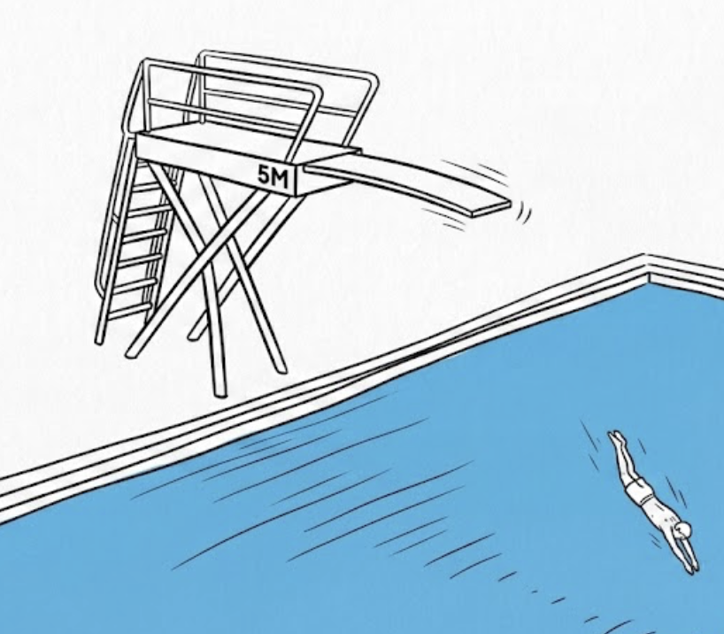
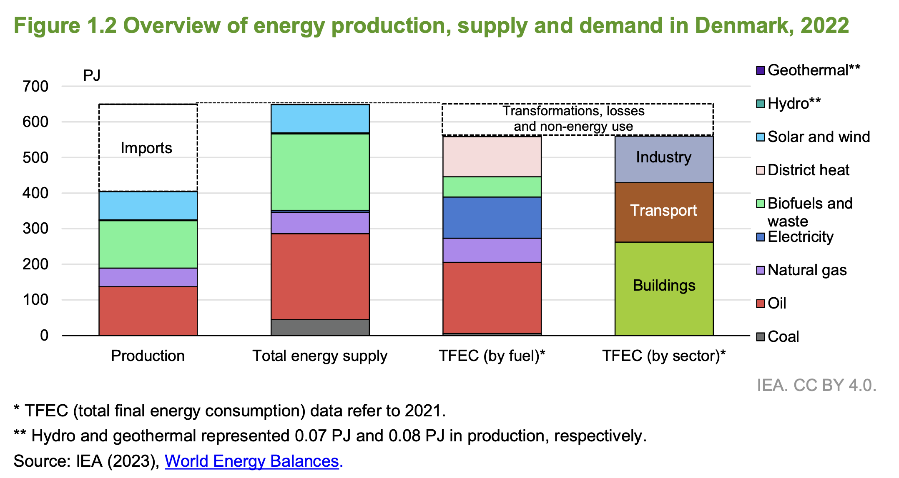
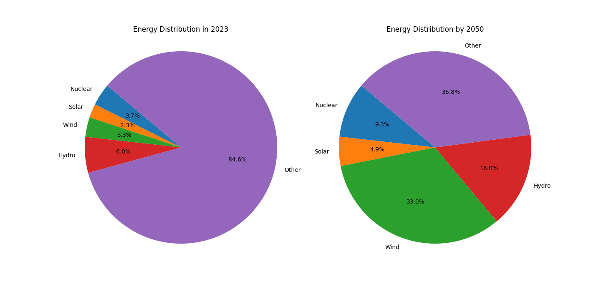
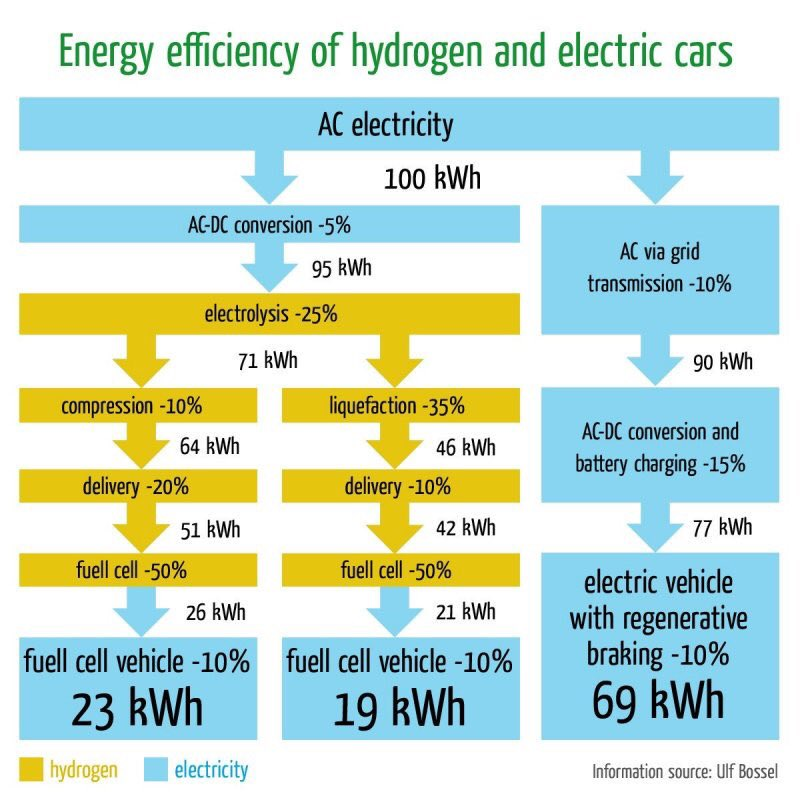

<link rel="stylesheet" href="style.css">

# Energi
## Potentiel energi
Potentiel energi kaldes også beliggenhedsenergi.

Den potentielle energien afhænger af **højden**, \(h\), og **massen**, \(m\), sådan at jo højere man er oppe og jo mere et objekt vejer, jo større er den potentielle energi. Derudover afhænger den af hvor hurtigt objekter accelerere mod den planet man er på. Den kaldes **tyngdeaccelerationen**, og har bogstavet \(g\).  På Jorden er den \(g = 9{,}82\), mens den på Månen er \(1{,}6\).

Den potentielle energi kan skrives som 
$$
\text{potentiel energi} = \text{masse} \cdot \text{tyngdeacceleration} \cdot \text{højde}
$$

Hvis vi skriver det med bogstaver er det,

$$E_{pot}=m⋅g⋅h$$

Hvis du løfter en liter mælk, \(m = 1\) to meter op, \(h=2\) i luften tilfører du den potentiel energi,

$$
E_{pot} = 1 \cdot 2 \cdot 9{,}82 = 19{,}64 \text{J}
$$

Enheden for energi er joules med bogstavet J.

### Eksempel

Burj Khalifa i Dubai er i øjeblikket, 2026, verdens højeste bygning med en højde på $h=828$m. Til sammenligning er Runde tårn kun $41{,}55$ meter højt. Vi kan nu regne energien det kræver at slæbe en drikkedunk hele vejen op. Min drikkedunk vejer $m=1$kg og energien for at få den op i Burj Khalifa kan beregnes med

$$
E_{pot} = m\cdot g \cdot h = 1\cdot 9{,}82 \cdot 828 = 8131 J 
$$

Jeg påstår at det er lige så hårdt at bære $20$ liter op i runde tårn som at bære 1 liter op i Burj Khalifa, passer der? Vi kan igen udregne energien

$$
E_{pot} = m\cdot g \cdot h = 20 \cdot 9{,}82 \cdot 41{,}55 = 8160 J
$$

Det kræver altså næste samme mængde energi.

### Tænkespørgsmål

* Hvorfor bliver du meget mere træt at at bære 1 liter op i Burj Khalifa end 20 liter op i Runde tårn?

### Enheder
I fysik bruger vi enheder for at vise hvad vi måler. Det giver for en fysiker ikke mening at sige at "temperaturen er 7", for 7 hvad? At temperaturen er "7 grader celcius" er til gængælde en glimrende oplysning, hvis man vil vide om man skal tage en sweater på.

Tabel: Fysiske størrelser og standard-enheder for potentiel energi

Fysisk størrelse  | Symbol    | Standard enhed       | Symbol 
------------------|-----------|-----------------------|---------------------------------
Energi             | E         | Joule                 | $\text{J}$
Højde              | h         | Meter                 | $\text{m}$
Masse              | m         | Kilogram               | $\text{kg}$
Tyngdeaccelerering  | g        | Meter per sekund i anden | $\text{m}/\text{s}^2$

#### Regnemed enheder
Hvis man bruger standard-enheder kan man lade være med at tage dem med i beregningerne. 

Man skriver det med enheder, men regner uden dem.

**Eksempel**

Massen af to heste som hver vejer 400kg beregnes som 

$$
m = 2\cdot 400 \text{kg} = 800 \text{kg}
$$

eller

$$
m = 2\cdot 400 = 800 \text{kg}.
$$

Resultatet skal altid være med enheder.

Hvis vi vil beregne hastigheden efter 2 sekunders frit fald gøres det ved,

$$
v = 9{,}82\text{m/s}^2\cdot 2\text{s} = 19{,}6\text{m/s}
$$

eller

$$
v = 9{,}82 \cdot 2 = 19{,}6\text{m/s}
$$

#### Omregning til standardenheder

For at regne rigtigt skal man først omregne til standard enheder. Hvis man er oppe i 2 km's højde og vejer 80 kg og skal beregne energien bliver det,

$$
E_{pot} = m \cdot g \cdot h =  80 \cdot 9{,}82 \cdot 2000 = 1.571.200 \text{J}
$$

### Øvelse

* Beregn den potentielle energi af en pony som er gået op på Himmelbjerget. Ponyens masse er $m=xx$ og højden af Himmelbjerget er $h= xx$.

* Beregn den potentielle energi en fodbold tilføjes når den sparkes 20 meter op i luften. Bolden vejer $m=400$ gram ( husk at omregn til kg).

Hvis vi skriver om på formlen for potentiel energi kan højden findes ved, $h = \frac{E_{pot}}{m \cdot g}$.

* $100$ gram chokolade indeholder ca. $620\text{kCal} = 148.000\text{J}$ energi. Beregn hvor langt op du kan komme, hvis du laver alt energien om til potentiel energi. 

På Månen er tyngdeaccelerationen $g=1{,}62$

* Hvor meget energi kræver det at løfte håndvægte med en masse på $20$kg, $1$ meter op, på Måne og på Jorden?

### Øvelse

* Angiv navnene for $m,g,h$.
* Angiv enhederne for $m,g,h$
* lidt svær men prøv. Hvilken mærkelig enhed må energi også have udover joule  når man ser på enhederne i udtrykket $m⋅g⋅h$         ( svar; $\text{J=kg⋅m}^2/\text{s}^2$, hvilket jo bare er $E=m⋅c^2$ ).

#### Tyngdeaccelerationen
Den styrke som Jorden trækker i genstande afhænger af jordens masse og giver anledning til en acceleration på $g=9{,}82\text{m/s}^2$. Et objekt som falder frit mod Jorden vil derfor forøge sin fart med $9{,}82\text{m/s}$ hvert sekund.

### øvelse
Du står på toppen af $5$ meter vippen og skal til at springe ud. Det tager ca. $t=1$ sekund før I rammer vandet, men hvad er jeres fart? 

* Beregn farten ved at gange tiden med acccelerationen ($t\cdot g$).

Man kan omregne om til km/time ved at gange med $3{,}6$.

* Hvad er jeres fart når I rammer vandet i km/time? 

Hvis du drister dig til at springe fra $10$ meter vippen så tager det ca. $1{,}43$ sekunder.

* Beregn farten når du rammer vandet.

### Øvelse

* Sæt streg over de forkerte formlen for hastigheden som funktion af tiden og accelerationen.     $v=t⋅g$, $v=g/t$, $v=t/g$.

# Kinetisk energi.
Kinetisk energi eller bevægelsesenergi er den energi der er i et objekt der bevæger sig. Jo hurtigere noget bevæger sig jo større er den den kinetiske energi. Den kinetiske energi afhænger også af massem, jo større masse jo mere kinetisk energi.

### Formlen for kinetisk energi

Variablene er massen, $m$ enhed [kg] og farten, $v$ ( kommer af velocity) enhed [m/s].

Sammenhængen mellem energi og bevægelse er

$$E_{kin}=\frac{1}{2}⋅m⋅v^2$$

Den kinetiske energi afhænger altså af hastigheden i anden! Hvis man fordobler farten bliver den kinetiske energi fire gange større. Det er derfor det er farligt at køre hurtigt.

tabel: Fysiske størrelser, potentiel energi.

Fysisk Størrelse       | Symbol    | Enhed             | Symbolet På Den Standardenhed
------------------------|-----------|--------------------|-----------------------------------
Potentielt Energi      | $\text{E}_{\text{pot}}$  | Joule               | J
Masse                   | m         | Kilogram           | $\text{kg}$
Hastighed               | v         | Meter per sekund   | $\text{m/s}$

#### Eksempel

En cyklist med en samlet masse på $70$ kg cykler $20\frac{km}{time} = 5{,}6 \frac{m}{s}$. Den kinetiske energi er,

$$
E_{kin} =  0{,}5 \cdot 70 \cdot 5{,}6^2 = 1097{,}6 \text{J}.
$$

En Tesla Cybertruck med en masse på $m = 2{,}6\text{tons} = 2600\text{kg}$ kører med $130\frac{km}{time} = 36\frac{m}{s}$. Den kinetiske energi er,

$$
E_{kin} = 0.5\cdot 2600\cdot 36^2 = 1.684.800 \text{J}.
$$

### Øvelse udregning af kinetisk energi.

Du rammes af en basketball med en hastighed på $v = 7{,}2\frac{\text{m}}{\text{s}}$. Boldens masse er $m = 880$ gram.

* Omregn til standardenheder (kg) og udregn den kinetiske energi.

Et projektil vejer $m=10$g og skydes med $v = 900\frac{\text{km}}{\text{time}} = 250\frac{\text{m}}{\text{s}}$.

* Omregn til standar-enheder og udregn den kinetiske energi. 
* Brug resultaterne til at forklare hvorfor det er meget værre at blive ramt af et prosektil end en basketball.

En bil har en masse på $m=1200\text{kg}$.

Beregn den kinetisk energi ved:

* Hastighed på $v=50\text{km}/\text{time}=13\text{m/s}$.
* Hastighed på $v =100\text{km}/\text{time}=28\text{m/s} $
* Hastighed på $v =130\text{km}/\text{time}=36\text{m/s} $
* Brug resultatet til at forklare hvorfor det er meget farligere at køre $130\text{km}/\text{time}$ end $100 \text{km}/\text{time}$.

### Øvelse enheder og fysiske størrelser
* Hvad er $v$ og hvad er enheden?
* I ligningen står den $v^2$ hvad er enheden nu?
* Tjek at $E_{kin}$ har samme enhed som $E_{pot}$.

## Energien er bevaret.
Energibevarelse gælder selvfølgeligt også for potentiel og kinetisk energi. Vi kan omdanne potentiel energi til kinetisk energi ved eks. at lade et objekt falde, eller omvendt fra kinetisk til potentiel energi ved at lave kaste en bold op i luften.

Hvis vi kun ser på potentiel og kinetisk energi kan bevarelsessætningen skrives som,

$$E_{kin} + E_{pot}= \text{konstant}$$

### Eksempel
I eksemplet fra svømmehallen starter man øverst på vippen. Vi er $5$ meter over vandet og står stille. Nu kan vi beregne båden den potentielle energi og den kinetiske energi. Lad os sige at personen er mig og jeg vejer $m=80$kg.

$$
\begin{align*}
E_{pot} = m \cdot g \cdot h = 80 \cdot 9{,}82 \cdot 5 = 3928\text{J} \\
E_{kin} = \frac{1}{2}⋅m⋅v^2 = 0.5 \cdot 80  \cdot 0^2 = 0J
\end{align*}
$$

Den kinetiske energi er nul fordi vi står stille. 

Farten ved overfladen regnede vi ovenfor til $v = 9{,}82\text{m/s}$. Vi kan nu regne energierne ud igen,

$$
\begin{align*}
E_{pot} = m \cdot g \cdot h = 80 \cdot 9{,}92 \cdot 0 = 0\text{J} \\
E_{kin} = \frac{1}{2}⋅m⋅v^2 = 0.5 \cdot 80  \cdot 9{,}91^2 = 3928J
\end{align*}
$$

Alt den potentielle energi er lavet om til kinetisk energi, så den samlede energi er bevaret.

Vi kan bruge denne vide til at finde hastigheden af et faldende objekt hvis vi kender den potentielle energi. Den ligning man skal løse er $m⋅g⋅h=\frac{1}{2}m⋅v^2$, hvor det er $v$ vi gerne vil finde.

Kan  vi se bort fra luftmodstanden? [Brian Cox feather drop experiment video](https://www.youtube.com/watch?v=E43-CfukEgs).

### Øvelse
Rundetårn er $41{,}55$ meter højt. Hvis man kaster en liter mælk ned, det må man ikke, vil den ramme Jorden med en stor hastighed, men hvor stor er den? Hvis vi isolerer farten $v$ i ligningen $m⋅g⋅h=\frac{1}{2}m⋅v^2$ får vi $v= \sqrt{2\cdot g\cdot h}$

* Brug ligningen til at finde ud af hvad farten er når mælken rammer Jorden ( gang med $3{,}6$ hvis I vil se det i km/timen). 
* Beregn den potentielle energi i toppen og den kinetiske i bunden.
* Er energien bevaret?

### Forsøg

#### Forsøg 1.

Sammenhængen mellem potentiel og kinetisk energi gælder også når vi kaster bolde op i luften. I skal finde ud med hvilken hastighed I kan kaste bolde op i luften. I skal bruge formlen fra før, $v= \sqrt{2\cdot g\cdot h}$ hvor $h$ er højden bolden kommer op.

* Kast en bold op i luften.
* Vurder hvor højt op I kan kaster en bolden.
* Udregn boldens hastighed.

#### Forsøg 2.

Kast igen bolden op i luften, men tag her tid på hvor langt tid det tager før den lander. Brug formlen $v = \frac{1}{2}\cdot g\cdot t$, til at bestemme starthastigheden.

### Øvelse
Phet har lavet en fin interaktiv animation med en skateboardbane og en skateboarder, [LINK](https://phet.colorado.edu/sims/html/energy-skate-park/latest/energy-skate-park_en.html)

* Vælg Intro og lad pigen køre på rampen.
* Vælg Energy i venstre hjørne og beskriv hvordan kinetisk og potentiel energi skifter.
* Klik på Graphs og prøv at fortolk graferne.
* Vælg tid ud af x-aksen, Time knappen. Hvordan kan I fortolke graferne?
*  Tilføj friktion, Friction, og beskriv hvad der sker med den kinetiske og potentielle energi. Hvad er der blevet af energien?
* Prøv selv at lave en bane i Playground.

#### Rapportforsøg: 1.d boldkast, energibevarelse.

## Energiformer
Dokumentet giver forskellige energiformer fordelt efter om de hører til potentiel eller kinetisk energi.
[Energiformer](dokumenter/energiformerPotKin.pdf)
Der kan ske transformation mellem forskellige energiformer,  eks. kan potentiel energi i et vandreservoir transformeres til bevægelsesenergi i en turbine.
### Øvelse
* Gemmengå dokumentet og overvej hvilke der kan transformeres til hvilke.

## Energikvalitet
Energikvalitet refererer til det brugbare arbejde, som en given mængde energi kan udføre. Jo højere energikvaliteten er, jo lettere er det at transformere den til andre energiformer uden tab i form at termisk energi. Termisk energi har generelt den laveste energikvalitet, med mindre der er tale om høj varme.

## Termisk ligevægt
Termisk ligevægt er en tilstand, hvor temperaturen er den samme i alle deler af et system. Det betyder, at varmen ikke længere flyder fra det ene område til det andet, og at der ikke længere er nogen nettovarmestrøm i systemet. Når et system er i termisk ligevægt, er det i en form for energi-ligevægt, hvilket betyder, at der ikke er nogen nettovarmestrøm i systemet.

## Nyttevirkning
Nyttevirkningen er forholdet mellem den nyttiggjorte energi og den tilførte energi. Den har det græske bogstav **eta**, $\eta$ og beregnes med

$$
\eta = \frac{E_{nyttig}}{E_{tilført}}
$$

### Eksempel
En 17kg kettle-bell løftes af stærke Torben fra gulvet og $2{,}0$ meter op. Stærke Torben bruger $E_{tilført} = 400\text{J}$ på løftet. Den tilførte potentielle energi er $E_{nytte} = m \cdot g \cdot h = 17\text{kg} \cdot 9{,}82\frac{\text{m}}{\text{s}^2} \cdot 2.0\text{m} = 334\text{J}$. Nyttevirkningen af Torbens løft er

$$
\eta = \frac{E_{nyttig}}{E_{tilført}} = \frac{334\text{J}}{400\text{J}} = 0.84
$$

Torben bruger altså $84\%$ af energien på løftet mens $16\%$ går til spilde som varme i Torbens krop.

## Øvelse: Beregning af nyttevirkning med Gravitricity

Forestil dig, at Gravitricity bruger et system, hvor en vægt på 5000 kg løftes op til en højde af 100 meter for at lagre energi. Når energien skal bruges, sænkes vægten, og den potentielle energi omdannes til elektrisk energi. Systemet bruger $E_{tilført} = 5{,}5\text{MJ} = 5.500.000\text{J}$ energi på at løfte vægten.

* Beregn den tilførte potentielle energi ved hjælp af formlen $E_{nytte} = m \cdot g \cdot h$, hvor $m = 5000 \text{kg}$, $g = 9{,}82 \frac{\text{m}}{\text{s}^2}$ og $h = 100 \text{m}$.
* Brug resultatet til at beregne nyttevirkningen ved hjælp af formlen $\eta = \frac{E_{nyttig}}{E_{tilført}}$.
* Diskuter, hvad resultatet fortæller om systemets effektivitet.

## Energienheden kWh
Kilowatt-time (kWh) er en enhed for energi, der ofte bruges til at måle elektrisk energi. En kilowatt-time svarer til den energi, der bruges, når en effekt på én kilowatt (1000 watt) forbruges i én time. Det er en praktisk enhed til at beskrive energiforbrug i husholdninger og industri, da det giver en nem måde at forstå, hvor meget energi der bruges over tid.

For eksempel, hvis en elektrisk ovn med en effekt på 2 kW er tændt i 3 timer, vil den bruge:

$$
2 \text{kW} \cdot 3 \text{timer} = 6 \text{kWh}
$$

Energiforbruget i kWh kan også omregnes til joule (J), som er den grundlæggende enhed for energi i det internationale enhedssystem (SI). En kWh svarer til 3.6 millioner joule (J):

$$
1 \text{kWh} = 3{,}6 \cdot 10^6 \text{J}
$$

Kilowatt-timer bruges ofte på elregninger for at vise, hvor meget energi en husstand har brugt i en given periode, og dermed hvor meget de skal betale for deres elforbrug.

### Danskers energiforbrug

Det samlede energiforbrug er enormt men hvis vi deler det op i hvor meget hver person bruger hver dag bliver det mere overskueligt. Det samlede danske energiforbrug per person per dag er:

$$
E_{total} = 90{,}6 \text{kWh}. 
$$

Det svarer ca. til at have to elkedler kørende hele tiden. Det er kun en lille del af vores forbrug som er i form af elektricitet. Det samlede danske elforbrug fordeler sig som.

$$
\begin{align*}
\\
&E_{el} &= 15{,}6 \text{kWh} \\
&E_{el-husholdninger} &= 4{,}38 \text{kWh}
\end{align*}
$$

### Øvelse

* Beregn hvor stor en del af det danske energiforbrug er elforbrug ved at udregne $\frac{E_{el}}{E_{total}}\cdot 100\%$.
* Udregn hvor stor del af husholdningernes elforbrug udgør af det totale energiforbrug. Gør som ved opgave 1. 
* Forklar hvorfor det er vigtigt at skelne mellem energi og elektricitet.

## Danmarks energiforbrug
Danmarks energiforbrug fordeler sig på forskellige typer

Danmarks produktion af vind og sol i 2022 var $79\text{PJ} = 79\cdot 10^{15}\text{J}$.

### Øvelse
Brug figur 1.2 ovenfor til at komme med et estimat af.

* Andelen af sol- og vind-energi produceret i Danmark.
* Andelen af sol- og vind-energi i vores forbrug (andelen af Total energy supply).
* Det menes at biofuel har ca. samme klimapåvirkning som kul, hvordan kan det være?
* Baseret på det I har regnet ud, hvor landt mener I vi er kommet med den grønne omstilling?
* Hvor stor en andel af Danmarks energi er import?
* Hvad har det med forsyningssikkerhed at gøre?

# Den globale udvikling i energi
Globalt set ser fordelingen af energi sådan ud i 2023 og en meget optimistisk fremskrigning til 2050.

Antagelser:
* Energiforbruget er det samme i 2050 som i 2023
* Andelen af find er tidoblet, [www.unep.or](https://www.unep.org/news-and-stories/story/new-report-envisages-10-fold-increase-global-wind-power-2050)
* Andelen af kernekraft er 2.5 gange større, [www.iaea.org](https://www.iaea.org/newscenter/pressreleases/iaea-outlook-for-nuclear-power-increases-for-fourth-straight-year-adding-to-global-momentum-for-nuclear-expansion)
* Solenergi er vokset til $9000$ TWh, [www.iea.org](https://www.iea.org/news/iea-sees-great-potential-for-solar-providing-up-to-a-quarter-of-world-electricity-by-2050)
* Hydro vokser med $4$ %, per år.

* Er det realistisk?

### Øvelse
Nedenfor er en oversigt over energiomsætningen ved elektriske køretøjer. Den venstre er omsætningen fra strøm over brint til energi i bilen. Den højre er fra strøm gennem batteri og til energi i bilen. 

* Find ud af hvad de forskellige trin gør og diskuter hvorfor der er energitab ved hver.
* Bestem nyttevirkningen af den forskellige teknologier.

### Løsning
1. Beregn den tilførte potentielle energi:
$$
E_{nytte} = 5000 \text{kg} \cdot 9{,}82 \frac{\text{m}}{\text{s}^2} \cdot 100 \text{m} = 4{,}91 \times 10^6 \text{J} = 4{,}91 \text{MJ}
$$