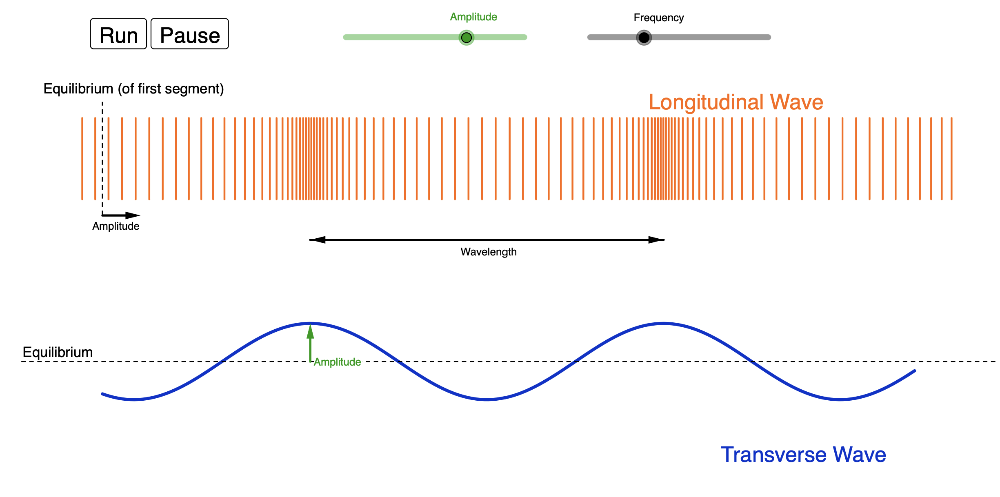

# Lyd og Bølger
Lyd er svingninger som forplanter sig gennem et medie. Oftest oplever vi det når lyde bevæger sig gennem atmosfærisk luft hvor det er luftmolekylerne som svinger frem og tilbage. Når man hører en tone bliver svinger molekylerne periodisk og danner skiftevis over og undertryk. Jo større trykforskellen er jo højere hører vi lyden.

Fysiske størrelser når en tone skal beskrives:
* $f$, Frekvensen, hvor mange gange den svinger hvert sekund, enhed hertz, Hz.
* $P$, Perioden, hvor lang tid der går mellem hver bølge, enhed sekund, s.
* $\lambda$, Bølgelængde, hvor langt der er mellem hver bølge, enhed meter, m.
* $v$, Fart, hvor hurtigt bølgen bevæger sig, enhed m/s.

Sammenhængen mellem perioden og frekvensen er
$f = \frac{1}{P}$

eksempel:
* Du gynger frem og tilbage og en hel svingning tager 2 sekunder. Frekvensen er derfor $f = \frac{1}{2\text{s}} = 0.5\text{Hz}$
* En elitesportskvinde kan have en hvilepuls på 30 slag per minut. Omregnet til sekunder giver det en frekvens på $f = \frac{30}{60 \text{s}} = 0.5\text{Hz}$. Vi får derfor igen en perioden på 2 sekunder som ved gyngeturen.

### Illustration af lydbølger

[link: lydbølger](https://www.geogebra.org/material/iframe/id/925705)
### Øvelse
* Kør simuleringen og beskriv i ord hvordan luftmolekylerne bevæger sig.
* Beskriv sammenhængen mellem de bevægelsen af luftmolekylerne og grafen nederst, kom ind på overtryk og undertryk.
* Lav om på amplituden og beskriv hvad der ændrer sig og hvad der ikke ændrer sig.
* Lav om på frekvensen og beskriv igen hvad der ændrer sig og hvad der ikke ændrer sig.
* Hvilken sammenhæng finder i mellem bølgelængden og frekvensen?
* Vurder om fart af bølgen er konstant når frekvensen ændres.

I simuleringen fandt I at bølgelængden bliver mindre når frekvensen bliver større. I fandt også, måske, at lydens fart var konstant når I ændrede på frekvensen. Sammenhængen memllem frekvens, $f$, bølgelængde, $\lambda$, og fart, $v$, er:

$v = f\cdot\lambda$

Hvis farten er konstant må bølgelænden altså gå blive mindre når frekvensen bliver større. Lydens hastighed i luft ved $30^\circ$ er $v = 343\text{m/s}$.

### Øvelse
Lad os lege med tanken at høje frekvenser ( lyse toner) var hurtigere end lave frekvenser ( dybe toner).
* Beskriv hvordan en udendørskoncert vil lyde i det setup.

### Øvelse
Det menneskelige ører kan høre lyde mellem 20Hz og 20000Hz, hvilket er ret imponerende. Hvis vi isolerer bølgelængden i ligningen for lydens fart er det $\lambda = \frac{v}{f}$.
* Brug formlen til at beregne bølgelængden for den dybeste og lyseste tone man kan høre.
* Hvis bølgelængden svarer til halvdelen af et rums længden kan lyden forstærke sig selv, kaldet resonans. Beregn hvilken frekvens dit værelse resonerer og prøv det af.
