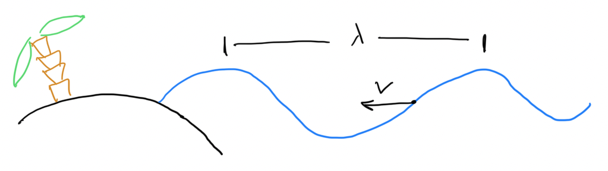
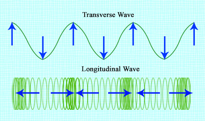
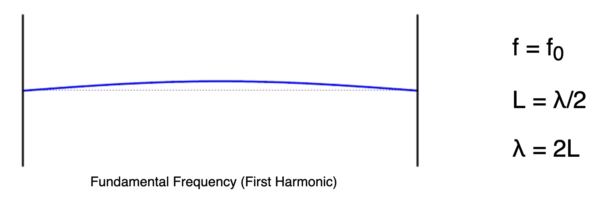
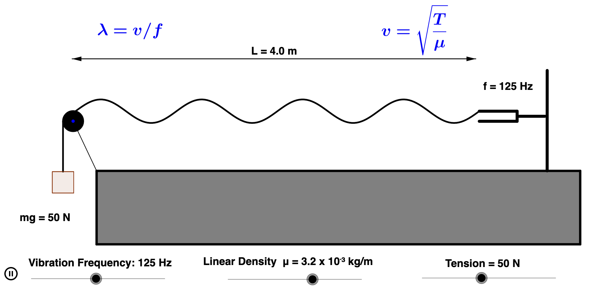
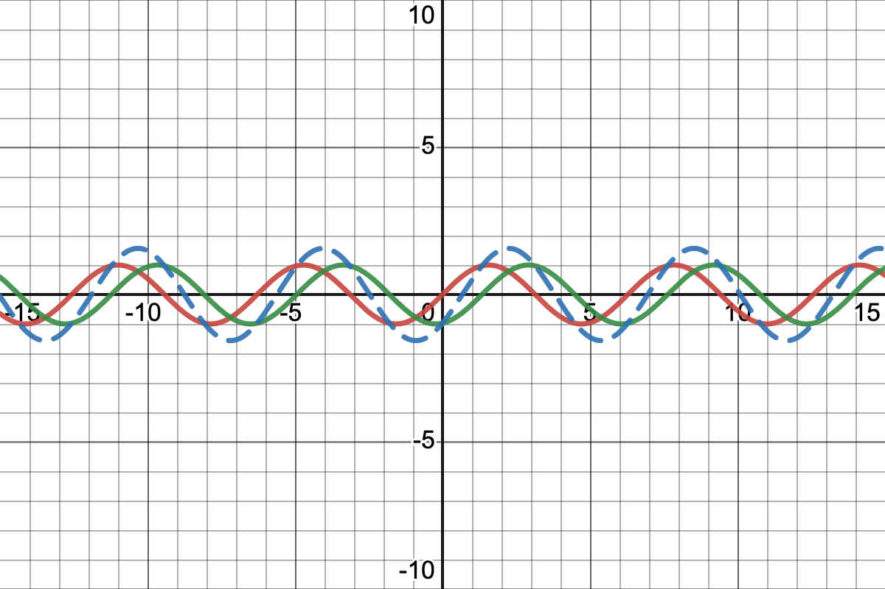

# Lyd og Bølger
Lyd er svingninger som forplanter sig gennem et medie. Oftest oplever vi det når lyde bevæger sig gennem atmosfærisk luft hvor det er luftmolekylerne som svinger frem og tilbage. Når man hører en tone svinger molekylerne periodisk og danner skiftevis over og undertryk. Jo større trykforskellen er jo højere hører vi lyden.

Fysiske størrelser når en tone skal beskrives:
* $f$, Frekvensen, hvor mange gange den svinger hvert sekund, enhed hertz, Hz.
* $P$, Perioden, hvor lang tid der går mellem hver bølge, enhed sekund, s.
* $\lambda$ lambda, Bølgelængde, hvor langt der er mellem hver bølge, enhed meter, m.
* $v$, Fart, hvor hurtigt bølgen bevæger sig, enhed m/s.

Sammenhængen mellem perioden og frekvensen er
$f = \frac{1}{P}$

eksempel:
* Du gynger frem og tilbage og en hel svingning tager 2 sekunder. Efter 1 sekund er du kommet halvejs frem og tibage og frekvensen er derfor $f = \frac{1}{2\text{s}} = 0.5\text{Hz}$.
* En elitesportskvinde kan have en hvilepuls på 30 slag per minut. Omregnet til sekunder giver det en frekvens på $f = \frac{30}{60 \text{s}} = 0.5\text{Hz}$. Vi får derfor igen en perioden på 2 sekunder som ved gyngeturen.

# Øvelse
* Mål din puls ved at tage tid på 10 slag og omregn til slag per minut.
* Udregn frekvensen og perioden for din puls.

### Illustration af lydbølger
Simuleringen viser en lydbølge som bevæger sig fra venstre mod højre.

[link: lydbølger, kilde ophysics.com](https://www.geogebra.org/material/iframe/id/925705)
### Øvelse
* Kør simuleringen og beskriv i ord hvordan luftmolekylerne bevæger sig.
* Beskriv sammenhængen mellem de bevægelsen af luftmolekylerne og grafen nederst, kom ind på overtryk og undertryk.
* Lav om på amplituden og beskriv hvad der ændrer sig og hvad der ikke ændrer sig.
* Lav om på frekvensen og beskriv igen hvad der ændrer sig og hvad der ikke ændrer sig.
* Hvilken sammenhæng finder i mellem bølgelængden og frekvensen?
* Vurder om fart af bølgen er konstant når frekvensen ændres.

I simuleringen fandt I at bølgelængden bliver mindre når frekvensen bliver større. I fandt også, måske, at lydens fart var konstant når I ændrede på frekvensen. Sammenhængen mellem frekvens, $f$, bølgelængde, $\lambda$, og fart, $v$, er:

$v = f\cdot\lambda$

Hvis farten er konstant må bølgelænden altså gå blive mindre når frekvensen bliver større.

## Eksempel

Forestil dig at du står på en strand og ser bølgerne kommer ind. Du vurderer bølgelængden til at være 8 meter. Du tager et stopur og vurdere at der går 2 sekunder mellem hver bælge. Vi kender nu følgende:
* $\lambda = 8m$
* $P = 2s$

Først regner vi frekvens til $f = \frac{1}{P} = \frac{1}{2s}=0.5Hz$.

Vi ved nu at der kommer en halv bølge på et sekund. Den samlede hastighed må så være, $v = 0.5Hz\cdot 8m = 4m/s$.

Vi har altså findet bølgernes hastighed til $v = 4m/s$.

### Øvelse
En violin udsender en lydbølge som bevæger sig gennem luften med en bølgelængde på $\lambda = 1.28\text{m}$ og får din trommehinde til at vibrere med en frekvens på $f=440\text{Hz}$ så du opfatter det som kaldes kammertonen.

* Beregn hvor hurtigt lyden bevæger sig.
* Beregn hvor lang tid der går fra tonen bliver udsendt til du hører den, hvis du står $100\text{m}$ fra violinen. 

## Lydens fart i atmosfærisk luft.
Lydens hastighed i luft ved $20^\circ C$ er $v = 343\text{m/s}$.

### Øvelse
Lad os lege med tanken at høje frekvenser ( lyse toner) var hurtigere end lave frekvenser ( dybe toner).
* Beskriv hvordan en udendørskoncert vil lyde i det setup.

### Øvelse
Når et lyn slår ned ser vi først glimtet og hører derefter braget. Det skyldes at lys bevæger sig næsten $900$ tusinde gange så hurtigt som lyden. Lys fart er $c = 299792458 m/s \approx 3.0\cdot 10^8 m/s$.

Når du ser et lyn og hører et tordenbrag er det derfor tiden det tager for lyden at nå dig som giver forsinkelsen.
* Beregn afstanden til et lyn når braget er $1$ sekund forsinket. Du skal bruge formlen $x = v\cdot t$ hvor $x$ er afstanden og $t$ forsinkelsen.

### Øvelse
Det menneskelige ører kan høre lyde mellem 20Hz og 20000Hz, hvilket er ret imponerende. Hvis vi isolerer bølgelængden i ligningen for lydens fart er det 
$$
\lambda = \frac{v}{f}
$$.

* Brug formlen til at beregne bølgelængden for den dybeste og lyseste tone man kan høre.
* Hvis bølgelængden svarer til halvdelen af et rums længden kan lyden forstærke sig selv, kaldet resonans. Beregn hvilken frekvens dit værelse resonerer og prøv det af.

## Forsøg med slinky
Vi skal prøve at finde sammenhængen mellem farten for en bølge i en slinky ved transversal og longitudinal bølge.

### Forsøgsbeskrivelse
NB! det er vigtigt at I har samme afstand mellem jer i de to forsøg.
* [longitudinal](https://youtu.be/0I9zmd3ZAag)
* [transversal](https://youtu.be/Ra4_vPdYW7k)

Longitudinalbølger
* Hold slinky mellem jer og sæt én enkelt transversalbølge i gang.
* Tag en film af bevægelsen.
* Mål hvor lang tid det tager for bølger at komme til enden med Logger Pro.
* Brug formlen $v = x/t$ til at beregne hastigheden.

Transversalbølger
* Lav svingninger med jeres slinky, så I får stående bølger.
* Optag en video af bevægelsen.
* Mål frekvensen og bølgelængden.
* Beregn farten ud fra formlen, $v = f\cdot\lambda$.

Sammenlign resultatet fra de to forsøg og udregn en procentvis afvigelse mellem dem. Den beregnes med,
$\text{procentvis afvigelse} = \frac{v_{transversalbølger}-v_{longitudinalbølger}}{v_{transversalbølger}}\cdot 100$%.

# Stående bølger
Simulering af stående bølger.

[Simulering af stående bølger](http://ophysics.com/waves6.html)

[Stående bølge på streng](http://ophysics.com/waves9.html)

# Interferens
Simulering af interferens.

[link: Interferens](https://www.desmos.com/calculator/av4cypshx9)

### Øvelse
Forestil jer at vi har tiden ud af x aksensen.
* Beskriv hvordan den stiplede bølge ændrer sig når du flytter på den blå kurve. I skal komme ind på amplitude og periode.

(superposition)[https://www.desmos.com/calculator/7kmnwux624]
