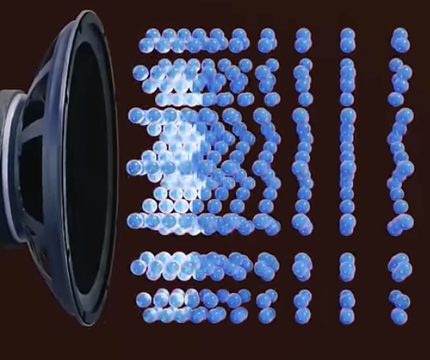
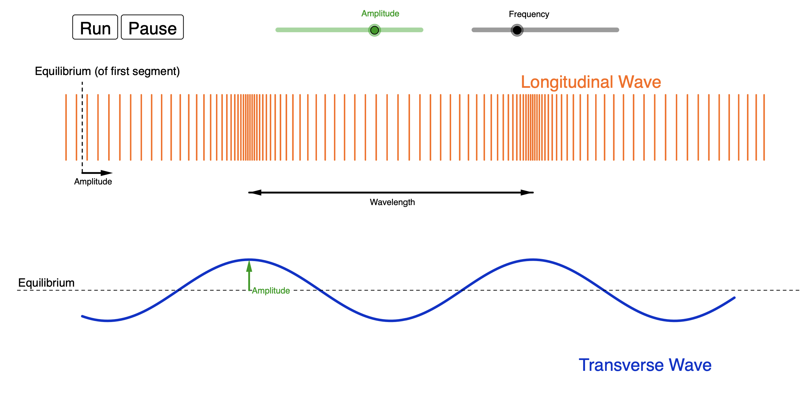
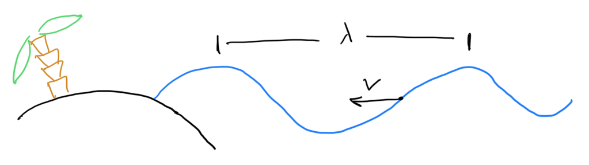
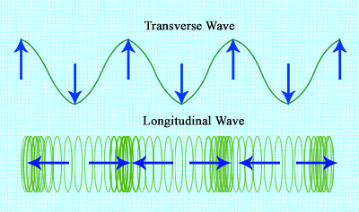
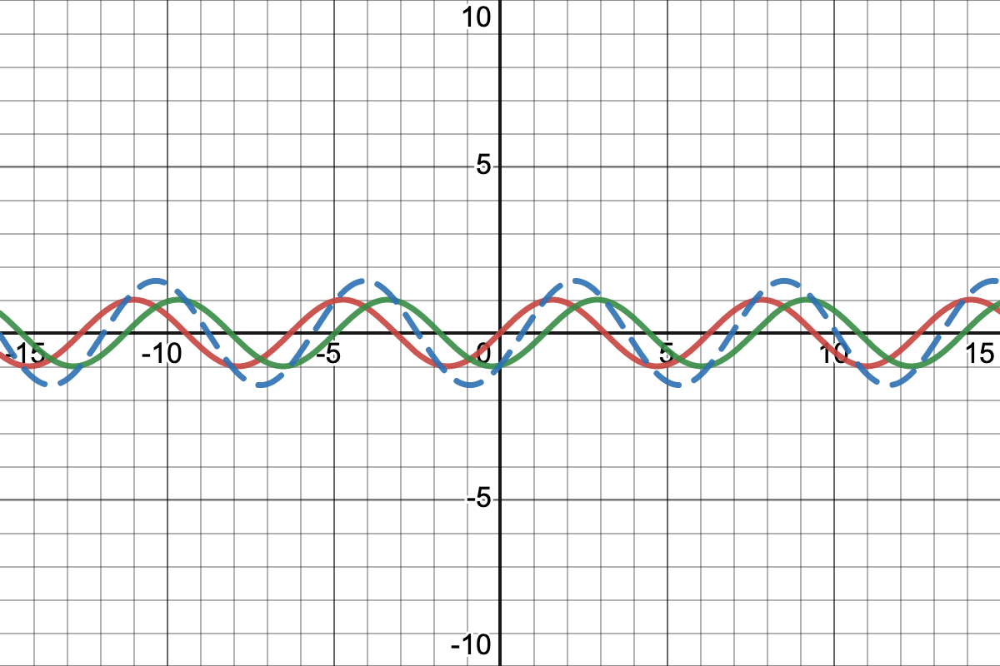
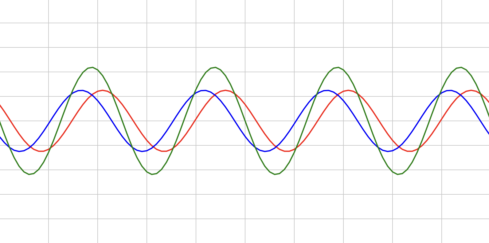
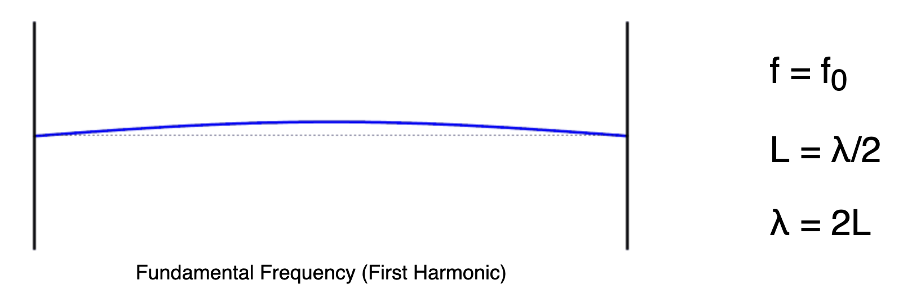
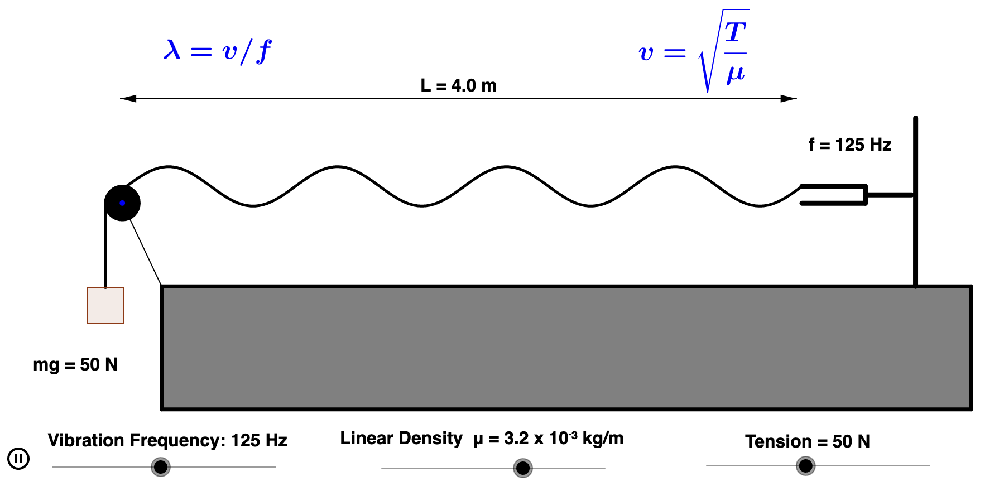
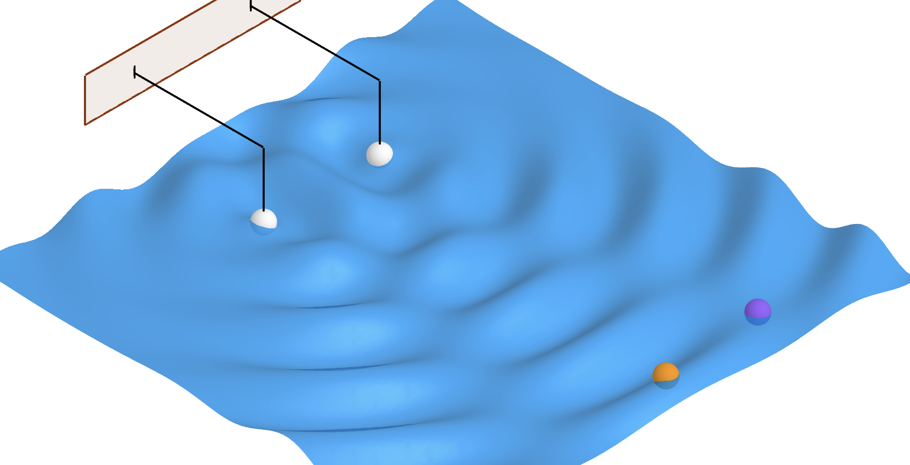
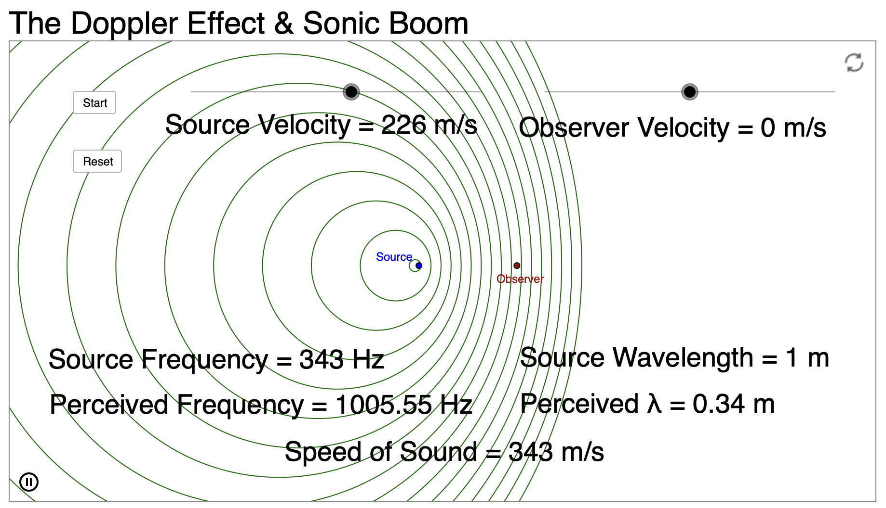

# Lyd og bølger

## Læringsmål
Efter dette kapitel skal du kunne:
- forklare, hvordan lyd udbreder sig i et medie som tryksvingninger.
- bruge størrelserne frekvens, periode, bølgelængde og bølgefart korrekt.
- anvende formlerne $f = \frac{1}{T}$ og $v = f\lambda$ i beregninger.
- forklare konstruktiv og destruktiv interferens.
- forklare resonans med eksempler fra hverdag og teknik.

---

## Introduktion til bølger
Bølger beskriver, hvordan energi udbredes. Vi møder dem blandt andet som:
- lydbølger i luft,
- vandbølger,
- lys og radiobølger.

Man skelner mellem:
- **mekaniske bølger** (fx lyd), som kræver et medium,
- **elektromagnetiske bølger** (fx lys), som kan udbrede sig i vakuum.

---

## Eksempel: Du taler i mobiltelefon
Når du taler, skaber stemmebåndene lydbølger i luft. Mikrofonen i telefonen omdanner lydbølgerne til elektriske signaler og derefter til digitale data.

Data sendes som elektromagnetiske bølger til en mast, videre gennem netværket og til modtagerens telefon. Her omdannes signalet tilbage til lyd i højttaleren.

Eksemplet viser samspillet mellem:
- mekaniske bølger (lyd),
- elektromagnetiske bølger (radiosignal).

### Øvelse
Lav en tegning af, at du ringer hjem. Vis tydeligt, hvordan informationen transporteres som bølger i de forskellige led.

---

## Hvad er lyd?
Lyd er svingninger, der forplanter sig gennem et medie. I luft er det luftmolekyler, der svinger frem og tilbage omkring deres ligevægt.

En tone giver skiftevis:
- **overtryk** (molekylerne står tæt),
- **undertryk** (molekylerne står mere spredt).

Større trykvariation (større amplitude) opleves som kraftigere lyd.

### Fysiske størrelser
- $f$: frekvens (Hz), antal svingninger pr. sekund.
- $T$: periode (s), tiden for én svingning.
- $\lambda$: bølgelængde (m), afstand mellem to punkter i samme fase.
- $v$: bølgefart (m/s).

Sammenhæng mellem frekvens og periode:

$$
f = \frac{1}{T}
$$

### Eksempler
- En gyngetur med periode $T = 2\,\text{s}$ giver
  $$f = \frac{1}{2\,\text{s}} = 0{,}5\,\text{Hz}.$$
- En hvilepuls på 30 slag/min svarer til
  $$f = \frac{30}{60\,\text{s}} = 0{,}5\,\text{Hz},$$
  altså periode $T = 2\,\text{s}$.

### Øvelse
- Mål din puls ved at tage tid på 10 slag og omregn til slag/min.
- Beregn frekvens og periode for din puls.

---

## Illustration af lydbølger
Video: 

Når højttalerens membran bevæger sig frem:
- den skubber til luftmolekylerne foran sig,
- en fortætning (overtryk) bevæger sig videre gennem luften.

Når membranen bevæger sig tilbage:
- der opstår en fortynding (undertryk),
- også denne udbreder sig som en del af lydbølgen.

Bemærk: Det er forstyrrelsen (energien), der bevæger sig fremad, ikke de samme luftmolekyler over lange afstande.

---

## Simulering af lyds udbredelse

[Link: lydbølger (kilde)](https://www.geogebra.org/material/iframe/id/925705)

### Øvelse
De orange linjer illustrerer luftmolekyler. Tætliggende linjer svarer til overtryk, og linjer med større afstand svarer til undertryk.

- Kør simuleringen og beskriv, hvordan områder med overtryk bevæger sig.
- Følg én enkelt streg: Hvordan bevæger den sig?
- Beskriv sammenhængen mellem molekylernes bevægelse og grafen nederst.
- Ændr amplituden: Hvad ændrer sig, og hvad ændrer sig ikke?
- Ændr frekvensen: Hvad ændrer sig, og hvad ændrer sig ikke?
- Hvilken sammenhæng ser I mellem bølgelængde og frekvens?
- Vurder, om bølgefarten er konstant, når frekvensen ændres.

I simuleringen ses typisk:
- højere frekvens giver kortere bølgelængde,
- bølgefarten i samme medium er (tilnærmet) konstant.

Sammenhængen er:

$$
v = f\lambda
$$

Hvis $v$ er konstant, må $\lambda$ blive mindre, når $f$ bliver større.

---

## Eksempel med vandbølger

Du vurderer:
- bølgelængde $\lambda = 8\,\text{m}$,
- periode $T = 2\,\text{s}$.

Først findes frekvensen:

$$
f = \frac{1}{T} = \frac{1}{2\,\text{s}} = 0{,}5\,\text{Hz}
$$

Dernæst farten:

$$
v = f\lambda = 0{,}5\,\text{Hz} \cdot 8\,\text{m} = 4\,\text{m/s}
$$

Bølgefarten er altså $4\,\text{m/s}$.

---

## Øvelse: Violinens tone
En violin udsender en tone med:
- $\lambda = 0{,}780\,\text{m}$,
- $f = 440\,\text{Hz}$ (kammertonen).

- Beregn lydens fart.
- Beregn tiden, før tonen når dig, hvis du står $100\,\text{m}$ fra violinen.

---

## Lydens fart i luft
Ved ca. $20^\circ\text{C}$ er lydens fart i luft cirka:

$$
v \approx 343\,\text{m/s}
$$

En mere præcis temperaturafhængig model (tør luft nær 1 atm) er:

$$
v = 331{,}3\,\text{m/s} \cdot \sqrt{1 + \frac{T}{273{,}15}}
$$

hvor $T$ er temperaturen i $^\circ\text{C}$.

Højere temperatur giver større molekylhastighed og dermed større lydfart.

### Øvelse (tankeeksperiment)
Forestil dig, at lyse toner bevægede sig hurtigere end dybe toner i luft.
- Beskriv, hvordan en udendørskoncert ville lyde for publikum længere væk.

---

## Øvelse: Lyn og torden
Lys bevæger sig cirka

$$
c = 299\,792\,458\,\text{m/s} \approx 3{,}0\cdot10^8\,\text{m/s}
$$

og derfor ser vi lynet næsten med det samme. Forsinkelsen til torden skyldes lydens endelige fart.

- Beregn afstanden til lynet, hvis torden kommer $3\,\text{s}$ efter glimtet. Brug $x = v\cdot t$.
- Vurdér tommelfingerreglen: “Antallet af sekunder svarer til antallet af kilometer til lynet.”

---

## Øvelse: Høreområdet
Menneskets høreområde er omtrent $20\,\text{Hz}$ til $20\,000\,\text{Hz}$.

Fra

$$
\lambda = \frac{v}{f}
$$

kan du:
- beregne bølgelængden for den dybeste og højeste hørbare tone,
- undersøge resonans i et rum, hvis halvdelen af bølgelængden passer med rummets længde.

---

## Forsøg med slinky
Målet er at sammenligne bølgefarten for longitudinale og transversale bølger i samme slinky.

### Forsøgsbeskrivelse
**Vigtigt:** Hold samme afstand mellem jer i begge del-forsøg.

Videoer:
- [Longitudinal bølge](https://youtu.be/0I9zmd3ZAag)
- [Transversal bølge](https://youtu.be/Ra4_vPdYW7k)

### Del A: Longitudinalbølger
- Hold slinky mellem jer og lav én tydelig puls langs slinkyen.
- Optag en video.
- Mål tiden, til pulsen når den anden ende.
- Beregn farten med $v = x/t$.

### Del B: Transversalbølger
- Lav stående bølger i slinkyen.
- Optag en video.
- Mål frekvens og bølgelængde.
- Beregn farten med $v = f\lambda$.

Sammenlign de to hastigheder med procentvis afvigelse:

$$
\text{afvigelse i \%} = \frac{|v_{\text{transversal}} - v_{\text{longitudinal}}|}{v_{\text{transversal}}}\cdot 100\%
$$

---

## Interferens
Interferens opstår, når bølger mødes og superponeres.
- **Konstruktiv interferens:** udsving forstærker hinanden.
- **Destruktiv interferens:** udsving modvirker hinanden.

### Simulering
Simuleringen viser to bølger (grøn og rød) og deres sum (stiplet):

$$
\text{stiplet} = \text{grøn} + \text{rød}
$$

[Link: Interferens](https://www.desmos.com/calculator/av4cypshx9)

### Øvelse
- Beskriv, hvordan den stiplede kurve ændrer sig, når du flytter den grønne.
- Hvornår er der konstruktiv interferens?
- Hvornår er der destruktiv interferens?

---

## Stående bølger
### Simulering

### Øvelse
Forestil dig, at den blå og den røde bølge bevæger sig modsat langs en guitarstreng. Den grønne er summen.

- Forklar, hvorfor det kaldes en stående bølge.
- Ændr den relative frekvens, så bølgerne ikke har samme frekvens. Hvad sker der med sumkurven?

Flere simuleringer:
- 
- 

---

## Bølger i to dimensioner
I vand udbreder bølger sig i to dimensioner ($x$ og $y$). Med to kilder opstår mønstre af konstruktiv og destruktiv interferens.

### Øvelse
Forklar bevægelsen af den orange og den lilla bold i simuleringen.

---

## Resonans
Alle svingende systemer har en eller flere egenfrekvenser.

**Resonans** opstår, når et system påvirkes periodisk med en frekvens tæt på en egenfrekvens, så amplituden vokser markant.

Eksempler:
- stemmegaffel,
- guitarstreng,
- glas,
- gyngen på legepladsen.

### Eksempel: Gynge
Hvis man skubber med samme periode som gyngens egenperiode, vokser udsvinget. Det er resonans.

---

## Broer og resonans
Store konstruktioner kan også rammes af resonansfænomener.

- Tacoma Narrows Bridge (1940): store vindinducerede svingninger.
- Millennium Bridge (2000): synkron gang gav uønskede tværsvingninger.

Videoer:
- [Tacoma Bridge Collapse (1940)](https://youtu.be/XggxeuFDaDU)
- [Millennium Bridge](https://youtu.be/y2FaOJxWqLE)

---

## Doppler-effekten

### Øvelse
1. Sæt `Source velocity = 0` og `Observer velocity = 0`.
   - Forklar, hvad du ser.

2. Sæt `Source velocity = 90 m/s`.
   - Forklar forskellen i den bølgelængde, observatøren modtager, når kilden bevæger sig hen imod og væk fra observatøren.
   - Forøg `Source velocity` og beskriv, hvad der sker.

3. Sæt `Source velocity = 0` og `Observer velocity` forskellig fra nul.
   - Hvordan opfatter observatøren situationen?

---

## Tjek dig selv
- Kan du forklare forskellen på mekaniske og elektromagnetiske bølger?
- Kan du beregne én af størrelserne $f$, $T$, $\lambda$ eller $v$, når de andre er givet?
- Kan du skelne klart mellem interferens og resonans?
- Kan du give et eksempel på Doppler-effekten fra hverdagen?
