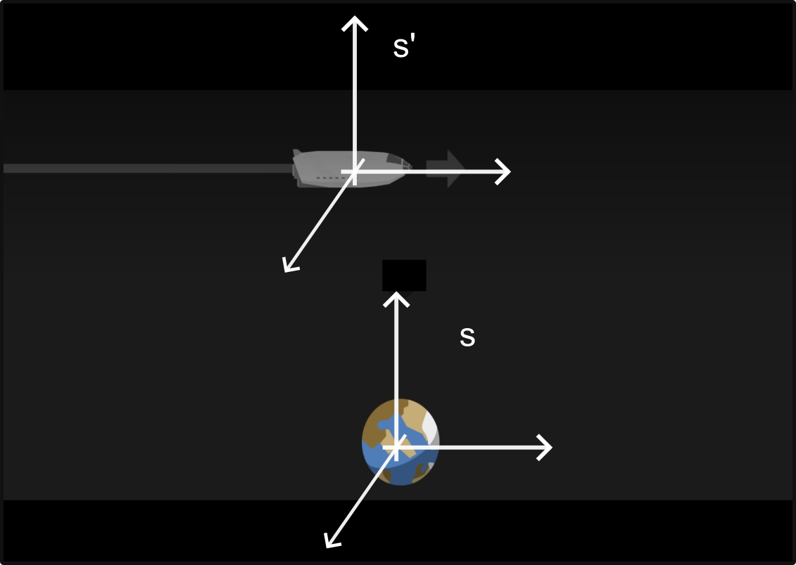
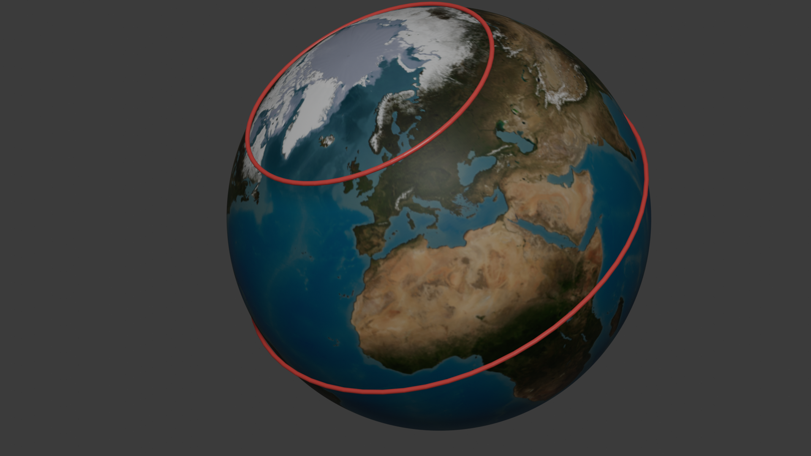
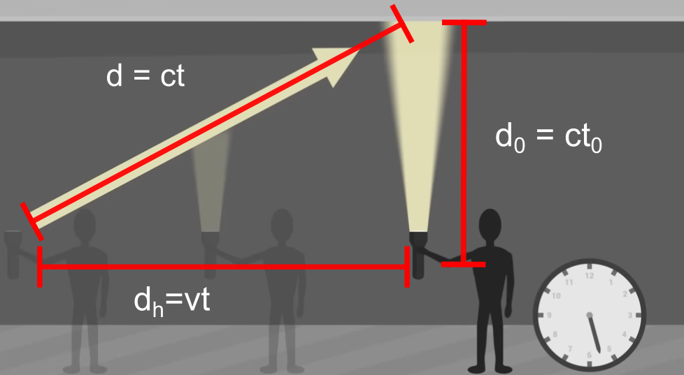
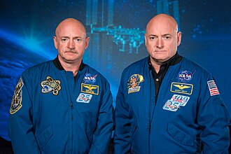

<link rel="stylesheet" href="style.css">

# Relativitetsteori

Velkommen til et af de mest fascinerende og kontraintuitive emner i fysikken: **Relativitetsteorien**. Når vi bevæger os med hverdagshastigheder – som når vi cykler til skole eller kører i bil – virker verden logisk og forudsigelig. Men hvad sker der, når hastighederne nærmer sig lysets fart, eller når vi kigger på universets helt store strukturer? Albert Einstein revolutionerede vores forståelse af tid, rum og bevægelse ved at vise, at fysikkens love afhænger af, hvem der kigger, og hvordan de bevæger sig.

## Initialsystemer

Vi kommer til at gennemgå en video og dens argumenter. Vi starter med at [Se første minut](https://youtu.be/uTyAI1LbdgA?t=62)

Et **initialsystem** er et koordinatsystem (eller en referenceramme), hvor Newtons første lov gælder. Det betyder kort fortalt, at hvis en genstand ikke påvirkes af en resulterende kraft, vil den enten ligge stille eller bevæge sig med en konstant hastighed i en retlinet bane.

> **Definition:** Et initialsystem er en referenceramme, der ikke accelererer. Alle referencerammer, der bevæger sig med konstant hastighed i forhold til et initialsystem, er selv initialsystemer.

### Fysik i fysiklokalet vs. toget

Forestil dig, at du står i dit fysiklokale og et tog kører forbi, måske kan du se Hovedbanegården fra lokalet. I laver eksperiment med 1.d bevægelse af en bold som I lader falde. I toget er en klasse i gang med præcist det samme forsøg. Toget kører med en hastighed på $20\frac{\text{km}}{\text{time}}$.

Først eksperimentet i toget, som I kan se gennem vinduerne.

* Beskriv den kurve bolden følger set fra toget.
* Beskriv den kurve bolden følger  set fra klasseloklalet. 

Nu eksperimentet i fysiklokalet som dem på toget også kan se, vinduer igen.

* Beskriv den kurve bolden vil følge set fra klasseloklalet. 
* Beskriv den kurve bolden beskriver vil følge set fra toget.

Som I kan se er beskrivelsen helt ens eller helt omvendt hvis I vil. Dette er netop **relativitetsprincippet**, hvor I ikke kan afgøre hvem der er i bevægelse og hvem der står stille.

### Tænkespørgsmål

  * Hvordan ser et fysikforsøg ud på ISS (Den Internationale Rumstation)?
  * Hvorfor føles bevægelser her anderledes end i fysiklokalet?

## Øvelse: Hvor hurtigt bevæger du dig egentlig?

Selvom vi føler, at vi sidder stille i fysiklokalet, er vi i konstant og hurtig bevægelse gennem universet. Lad os regne på de hastigheder, vi normalt ignorerer.

**Opgave 1: Jordens rotation**

Jorden drejer om sin egen akse én gang pr. døgn. Da jorden er en kugle, afhænger din hastighed af din breddegrad. Ved ækvator er hastigheden højest, mens den er nul ved polerne. Omkredsen i cirklen kan beregnes som,

$$
d_{omkreds} = 2 \cdot \pi \cdot R_{jord} \cdot \cos(\phi).
$$

For København ,ca. $\phi = 55.67^{\circ}$ nordlig bredde og $R_{jord} \approx 6371 \text{ km}$.

* Beregn $d_{omkreds}$.

Hastigheden kan beregnes som længden man har bevæget sig divideret med hvor lang tid det har taget,

$$
v = \frac{d_{omkreds}}{T},
$$

hvor $T = 24 \text{ timer}$.

* Beregn farten i km/t.

**Opgave 2: Jorden omkring Solen**
Jorden bevæger sig i en næsten cirkulær bane om solen med en radius på ca. $149,6 \text{ millioner km}$ (1 AE). Tiden for et omløb er 1 år ($365,25$ døgn).

  * Brug formlen for omkredsen i en cirkel til at beregne hvor langt Jorden har bevæget sig på ét år.
  * Beregn Jordens fart i sin bane omkring Solen. 
  
**Opgave 3: Solen i Galaksen**
Vores solsystem er ikke stationært; det kredser om centrum af Mælkevejen i en afstand af ca. $26.000$ lysår. Et "galaktisk år" tager omkring $230$ millioner år.

  * Beregn solens (og dermed din) fart omkring galakse-centret i km/s?

**Opgave 4: Så sid dog stille**

* Forklar, ved at bruge ideen om initialsystemer, hvorfor kan kan sidde stille og roligt og drikke en kop te, når nu man bevæger sig så hurtigt!

Lige som på ISS så bevæger vi os i cirkler, Jorden om egen akse, Jorden om Solen og Solen om galakse-centret.

* Hvorfor er det vi oplever det som om vi er i et initialsystem, når vi faktisk bevæger os rundt i cirkler.

Her er en beskrivelse af Einsteins to postulater, som de bør præsenteres i dit undervisningsmateriale. Disse to enkle antagelser er selve fundamentet, som hele den specielle relativitetsteori er bygget på.

## Einsteins to postulater

I 1905 udgav Albert Einstein artiklen *"Om bevægede legemers elektrodynamik"*. Her opstillede han to grundlæggende antagelser, som udfordrede vores klassiske forståelse af fysikken:

> **1. Det specielle relativitetsprincip**
Fysikkens love er de samme i alle initialsystemer.

Dette betyder, at hvis du udfører et fysikforsøg i et laboratorium, der står stille på Jorden, vil du få nøjagtig samme resultat, hvis du udfører det i et tog eller et rumskib, der bevæger sig med konstant hastighed. Der findes altså ikke én "rigtig" hviletilstand i universet; al jævn bevægelse er relativ.

* **Eksempel:** Hvis du taber en bold i et tog, der kører jævnt, falder den lodret ned præcis som i dit soveværelse.

> **2. Princippet om lysets konstans**
Lysets fart i vakuum har den samme værdi $c=299 792 458 \text{m/s} \approx 3\cdot 10^8 \text{ m/s}$ for alle observatører, uanset deres egen bevægelse eller lyskildens bevægelse.

## Eksperiment: lysets hastighed
Vi skal lave et meget simpelt eksperiment hvor vi kan bestemme lysets hastighed. Som i Olsenbanden er udstyrslisten god. Vi skal bruge; 1 mikrobølgeovn, et stykke bøjet pap, en lineal og en æske lys pålægschokolade.

**Teori**

Vi kan bruge bølgeligningen til at estimere lysets hastighed. Bølgeligningen,

$$
v = \lambda \cdot f,
$$

hvor $\lambda$ er bølgelængden og $f$ frekvensen.

I en mikrobølgeovn opstår der stående bølger og vi kan måle bølgelængden ved at se på hvor den lyse pålægschokolade smelter. 

Den lyse pålægschokolade smelter der hvor der er bug i de stående bølger. Hvis vi måler afstanden mellem finder vi altså $\lambda/2$. 

**Udførsel**

* Placer det bøjede pap, så chokoladen ikke drejer rundt.
* Placer den lyse pålægschokolade og tænder ovnen i et minut.
* Mål afstanden mellem der hvor den er smeltet.

**Databehandling**

* Beregn bølgelængden og hastigheden.
* Sammenlign med lysets hastighed ved afvigelse i %.

## Addition af hastigheder 

[Se videoen fra 1:00 til 2:33](https://youtu.be/uTyAI1LbdgA?t=62)

**Opgave 5: addition af hastigheder**

Vi lader rumskibet bevæge sig med en hastighed på $v_s = 200\frac{\text{m}}{\text{s}}$ i forhold til Jorden og bolden blive kastet med en hastighed i forhold til personen på $10\frac{\text{m}}{\text{s}}$.

* Beregn den hastighed som en person på Jorden ser bolden bevæge sig med.

Lad os skrue hastigheden af rumskibet op til 99% af lysets hastighed og lade personen tænde en lommelygte pegende frem idet han passere Jorden.
* Med hvilken hastighed ser personen i rumskibet lyset bevæge sig med?
* Med hvilken hastighed ser personen på Jorden lyset bevæge sig med?

Den måde man addere hastigheder gælder altså ikke for lys og hastigheden er altid den samme!

> **Ifølge relativitetsteorien er alt relativt, undtagen lysets hastighed i vacuum som altid er den samme!**

## Samtidighed
Vi skal se på hvilken konsekvenser det at lysets hastighed er konstant har. Vi starter med at se på hvad det betyder for forståelsen af at noget sker samtidigt.

* [Se videoen fra 2:33 til 4:22](https://youtu.be/uTyAI1LbdgA?t=62)

I videoen udsender personen i rumskibet to lysstråler og alt efter om man står på Jorden eller er i rumskibet ser det ikke ud til at de rammer endevæggene samtidigt. Lad os starte med at udregne hvordan det ser ud hvis det ikke er lys, men en bold han kaster.

### Udledning

**Opgave 6: ikke relativistisk**

Nedenfor er udledningen skrevet. For at følge den skal I
* Tegne situationen, rumskib, Jorden, bolden, manden.
* Skrive udledningen op og diskutere de forskellige dele.

Vi lader personen stå i midten af rumskibet og kaste to bolde en frem og en tilbage. Lad rumskibet være 20 meter langt og hastigheden han kaster med være om $10\text{m/s}$. 

### Set fra rumskibet
Afstanden bolden har bevæget sig er givet ved hastigheden gange tiden $(x = v\cdot t)$.

* Vis at det tager bolden $t_{bag} = 1\text{s}$ før den rammer bagvæggen.
* Vis at det tager bolden $t_{bag} = 1\text{s}$ før den rammer forvæggen.
* Hvad kan personen i rumskibet konkludere om samtidigheden af de to begivenheder?

### Set fra Jorden
Fra Jorden ser der lidt anderledes ud.
* Rumfartøjets fart: $v = 200 \text{ m/s}$.
* Boldens fart relativt til skibet: $10 \text{ m/s}$.
* Boldens fart mod fem: $v_{frem} = 200 + 10 = 210 \text{ m/s}$.
* Boldens fart mod bagud: $v_{bag} = 200 - 10 = 190 \text{ m/s}$.

Vi lader $t = 0$ være affyringstidspunktet, hvor rumskibets midte er i $x = 0$.
* Forvæggens startposition: $x = 10 \text{ m}$.
* Bagvæggens startposition: $x = -10 \text{ m}$.

### 2. Udregning for forvæggen
Forvæggen bevæger sig væk fra bolden. Vi skal finde det tidspunkt $t_{for}$, hvor boldens position er lig med væggens position.

Væggens position: $x_{væg}(t) = 10 + 200 \cdot t$
Boldens position: $x_{bold}(t) = 210 \cdot t$

* Sæt de to ligning lig hinanden og løs for $t_for$

Løsning: 
Vi sætter dem lig hinanden:
$$
210 \cdot t = 10  + 200  \cdot t \Leftrightarrow
210 t - 200 \cdot t = 10  \Leftrightarrow
10  \cdot t = 10 \Leftrightarrow
t_{for} = 1   
$$

### 3. Udregning for bagvæggen
Bagvæggen bevæger sig mod bolden. Vi skal finde det tidspunkt $t_b$, hvor de mødes.

Væggens position: $x_{væg}(t) = -10 + 200 \cdot t$

Boldens position: $x_{bold}(t) = 190 \cdot t$

* Sæt de to ligning lig hinanden og løs for $t$

Løsning:
$$190  \cdot t = -10  + 200  \cdot t \Leftrightarrow -10  \cdot t = -10  \Leftrightarrow t = 1 \text{s}$$

* Hvad mener personen på Jorden om samtidigheden af de to begivenheder?

Med bolde er begivenhederne altså ens, men hvad med lys.

### Hvorfor dette knækker med lys (Einstein)
Hvis vi erstatter bolden med lys, må vi **ikke** bruge $v_{frem} = 210\text{ m/s}$ og $v_{bag} = 190 \text{ m/s}$. Vi skal bruge $c$  begge steder.

Hvis du prøver at indsætte $c$ i de samme ligninger:
* $c \cdot t = 10 + 200 \cdot t \Rightarrow t_f = \frac{10}{c - 200}$
* $c \cdot t = -10 + 200 \cdot t \Rightarrow t_b = \frac{10}{c + 200}$

Her bliver nævnerne forskellige ($c-200$ vs $c+200$), og derfor bliver tiderne observeret forskellige.

### Konklusion
Vi kan nu konkludere, at de to personer ikke ser lyset ramme samtidigt. Helt generelt viser den specielle relativitetsteori at to personer i relativ bevægelse i forhold til hinanden ikke er enige om hvornår noget sker.

Hvis man skal svare på spørgsmålet "skete det samtidigt" kræver det at personerne står stille i forhold til hinanden.

**Opgave 7: langsomt lys**

Lad os antage at lyset kun bevæger sig med $c=300\text{m/s}$.
* Beregn tidsforskellen på at lyset rammer forenden i forhold til bagenden af rumskibet, set fra Jorden, $\Delta t = f_{b}-t_{f}$.

**Opgave 8: hurtigt lys**

Lad os nu give lyset sin rigtige fart på $ c = 3\cdot 10^8 \text{m/s}$ og lade rumskibet bevæges sig med samme hastighed som den internationale rumstation, ISS, $v = 7.66 \text{km/s}$.
* Beregn tidsforskellen på at lyset rammer forenden i forhold til bagenden af rumskibet, set fra Jorden, $\Delta t = f_{b}-t_{f}$.

### Hvorfor er det vigtigt?
Kombinationen af Einsteins to postulater tvinger os til at opgive tanken om, at tid og rum er absolutte. Hvis lysets fart skal være den samme for alle (postulat 2), mens fysikkens love skal gælde overalt (postulat 1), så bliver **tiden** nødt til at strække sig, og **længder** nødt til at trække sig sammen, når man bevæger sig hurtigt. Det er præcis det, vi så i udledningen af tidsforlængelsen med lysuret.

## Tidsforlængelse: Når tiden strækker sig

Når vi har accepteret Einsteins postulat om, at lysets fart er den samme for alle observatører, uanset deres egen bevægelse, støder vi på en mærkværdig konsekvens: **Tiden går ikke lige hurtigt for alle.** For at forstå dette, bruger vi ofte et tankeeksperiment med et "lysur" placeret i et tog.

### Tankeeksperimentet med lysuret

[Se videoen fra 7:15 til 9:00](https://youtu.be/uTyAI1LbdgA?t=62)

I filmen udsender astronauten en lysstråle lodret op fra gulvet som rammer loftet. Ved at måle tiden det tager har han nu skabet et ur. Tiden det tager for lyset at nå loftet, kalder vi egen-tiden $t_0$. Da lysets fart er $c$, er distancen til loftet givet ved $c \cdot  t_0$.

Fra Jorden skal vi tage bevægelsen af rumskibet med. Lysstrålen bevæger sig ikke kun op men også til siden og bruger tiden $t$. Da lysets fart $c$ skal være den samme, må tiden $t$ nødvendigvis være længere end $t_0$.

Dette fænomen kaldes **tidsforlængelse** (eller tidsdilatation).

### Udledning via Pythagoras

Vi kan bruge figuren til at lave en retvinklet trekant.

  * **Den lodrette katete ($c \cdot t_0$):** Dette er den lodrette afstand til loftet (som set af Astrid).
  * **Den vandrette katete ($v \cdot  t$):** Dette er den afstand, toget har flyttet sig, mens lyset bevæger sig mod loftet (som set af Bertil).
  * **Hypotenusen ($c \cdot  t$):** Dette er den faktiske distance, som lyset tilbagelægger (som set af Bertil).

Ved at bruge Pythagoras' læresætning ($a^2 + b^2 = c^2$) på trekanten får vi:

$$(v \cdot  t)^2 + (c \cdot  t_0)^2 = (c \cdot  t)^2$$

Hvis vi isolerer $ t$ (tiden målt af den stationære observatør), ender vi med den berømte formel for tidsforlængelse:

$$ t = \frac{1 }{\sqrt{1 - \frac{v^2}{c^2}}} \cdot t_0$$

Denne ligning viser, at jo tættere $v$ kommer på lysets hastighed $c$, desto mindre bliver nævneren, og $t$ bliver meget større end $t_0$.

$t_0$ er egentiden i rumskibet og er altså mindre end $t$ som måles fra Jorden.

Vi kan definere den faktor som skal ganges på $t_0$ for at få $t$. Den kaldes gamma-faktoren og defineres som:

$$
\gamma = \frac{1 }{\sqrt{1 - \frac{v^2}{c^2}}}.
$$

Tidsforskellen kan skrives som $t = \gamma t_0$.

**Eksempel**
Hvis en person rejser i et år med $90$% af lysets hastighed relativt til Jorden vil den tid der er gået på Jorden være

$$
t = \frac{1}{\sqrt{1-\frac{(0.9c)^2}{c^2}}} \cdot 1\text{år} = 2.29 \text{år}.
$$

Der er altså gået over dobbelt så lang tid på Jorden som i rumskibet. Tiden er med andre ord gået langsommere på rumskibet.

> **Vigtig pointe:** Tiden går langsomst for den person, der bevæger sig hurtigt i forhold til observatøren.

Vi har udregnet det med et lysur, men det gælder **alt**, både Bornholmerure, armbåndsure men også hjerteslagene i din krop og synapserne i din hjerne. Selve tiden går langsommere og alt der er påvirket af tiden vil gå langsommere. Lige som om noget sker samtidigt er selve det at tiden går relativt. 

**Tænkespørgsmål**

* Hvorfor mærker vi ikke tidsforlængelse, når vi kører i et almindeligt tog med $180$ km/t?
* Hvad ville der ske med $t$, hvis man kunne rejse med præcis lysets hastighed ($v = c$)?

**Opgave 9: Tidsforlængelse**

I opgave 1,2 og 3 udregnede vi hvor hurtigt vi bevæger os.
* Brug den fundne hastighed til at beregne hvor meget langsommere 

**Opgave 10: Rumrejser går da hurtige, eller**

Vi vil gerne besøge vores nærmeste stjerne udover Solen som hedder Proxima Centruri og er $4,25$ lysår væk. Lad os rejse med 85% af lysets hastighed.

Set fra Jorden skal rumskibet rejse en afstand på $x = 4,15\text{ly}$ med en fart på $v = 0.85c$.

* Beregn hvor lang tid det tager.

Ombord på rumskibet går tiden langsommere,

* Beregn gamma-faktoren.
* Beregn tiden i rumskibet, $t$.
* Overvej hvordan rumskibet kan nå Proxima Centruri så hurtigt, når Proxima Centauri nu ligger $4,25\text{ly}$ væk.

**Opgave 11: Tvillingeparadokset**
Tvillingeparadokset er et af de mest berømte tankeeksperimenter inden for den specielle relativitetsteori. Det illustrerer konsekvenserne af **tidsforlængelse**.

vi vil bruge beregningerne fra før, men lad nu rumskibet svinge omkring Proxima Centauri og vende tilbage til Jorden. Vi antager at den tid det tager at svinge rundt er meget lille og ser bort fra den.

* Beregn hvor lang tid hele rejsen vil tage, set fra Jorden (meget let beregning).
* Beregn hvor lang tid hele rejsen vil tage, set fra rumskibet (igen meget let beregning).

Tvillingeparadokset går nu ud på at en af astronauterne, om bord på rumskibet har en tvilling. Det kunne jo være Scott på rumsikbet og Mark på Jorden.

* Hvor meget ældre vil Mark være i forhold til Scott, når rumrejsen er slut?

Det paradoksale ligger altså i at to tvillinger lige pludseligt ikke er lige gamle. Det er også muligt at blive yngre end sin mor, hvis man altså sende hende afsted på i et rumskib!

Der er en del 2 i paradokset. Ifølge relativitetsteorien er alle initialsystemer lige gode og man kan ikke sige hvem der er i bevægelse og hvem der står stille. Scott Kelly kan altså argumentere for at det er ham som står stille og Mark Kelly på Jorden som bevæger sig. På den måde burde det være Scott som var ældst efter turen. 

Der sker noget på rumrejsen som gør at Scott Kelly ikke er i et initialsystem hele tiden og det er netop derfor Mark er ældst.

* Prøv at finde ud af hvad det kan være ved at se op definitionen af initialsystemer.

**Opgave 12: Kelly tvillingerne igen**

Scott Kelly er den person som har været længst på den internationale rumstation (ISS), 520 dage, men hans bror Mark Kelly blev på Jorden. Rumstationen bevæger sig med en fart på $7,67 \text{ km/s}$ og ifølge Wikipedia betyder det at han ældet ca. $8,6 \text{milli sekunder}$ i forhold til sin tvilling.

**Opgave 13:**

* prøv at regn efter om Wikipedia har ret.

## længde-formindskelse

[Se videoen fra 5:20 til 6:15](https://youtu.be/uTyAI1LbdgA?t=62)

Forestil dig et rumskib, der rejser fra en stjerne til en anden med hastigheden $v$.

* **Observatør på Jorden (System S):** Ser afstanden mellem stjernerne som en fast længde, $L_0$ (hvilelængden). Tiden det tager for rejsen, måles på Jordens ure som $t$.
* **Observatør i rumskibet (System S'):** Rumskibet står stille i sit eget system. For rumskibet er det stjernerne, der suser forbi. Tiden for rejsen måles på rumskibets eget ur som $t_0$ (egentiden). Rumskibet måler afstanden som $L$.

### 2. Definition af hastighed
Hastighed er defineret som strækning divideret med tid ($v = \frac{s}{t}$). Da begge observatører skal måle den samme relative hastighed $v$ (ifølge relativitetsprincippet), kan vi opstille to ligninger:

1.  **For Jorden:** $v = \frac{L_0}{t}$
2.  **For rumskibet:** $v = \frac{L}{t_0}$

Da $v$ er den samme, kan vi sætte de to udtryk for strækning op:
$$L_0 = v \cdot t$$
$$L = v \cdot t_0$$

### 3. Substitution af tidsforlængelsen
Vi ved fra din tidligere udledning, at sammenhængen mellem tiderne er:
$$t = \frac{t_0}{\sqrt{1 - \frac{v^2}{c^2}}}$$

Nu indsætter vi dette udtryk for $\Delta t$ i ligningen for $L_0$:
$$L_0 = v \cdot \left( \frac{t_0}{\sqrt{1 - \frac{v^2}{c^2}}} \right)$$

### 4. Den færdige formel
Vi ser nu, at leddet $v \cdot t_0$ er det samme som $L$ (længden målt fra rumskibet). Vi kan derfor erstatte $v \cdot t_0$ med $L$:
$$L_0 = \frac{L}{\sqrt{1 - \frac{v^2}{c^2}}}$$

Hvis vi isolerer $L$ (den forkortede længde), får vi den endelige formel for længdeforkortelse:
$$L = L_0 \cdot \sqrt{1 - \frac{v^2}{c^2}}$$
$$L = \frac{1}{\gamma}L_0$$

### Konklusion
Da udtrykket under kvadratroden altid er mindre end 1 (når $v < c$), vil den målte længde $L$ altid være **mindre** end hvilelængden $L_0$.

**Opgave 14: turen til Proxima Centauri**

I opgave 11 udregnede I at det tog $t_0 = 2,64\text{år}$ i rumskibets egentid at tilbagelægge afstanden mellem Jorden og Proxima Centauri. Med en afstand på $4,25\text{ly}$ skal de have en fart på $v = 1,6\cdot c$, men det er jo højere end lysets hastighed.

* Brug formlen for længdeforkortelse til at udregne en ny længde for afstanden mellem Jorden og Proxima Centauri.
* Undersøg om de kan nå dertil på $2,64\text{år}$ med en fart på $v = 0.85\text{ly}$.

**Opgave 15: stigen i vognen**
En pensioneret overlærer vil gerne hjælpe sin datter med at male. Da datteren bor højt oppe har den pensionerede overlærer brug for en lang stige. Den pensionerede overlærers stige er 4,2 meter lang og han har en Morris Minor

## Udledningen Schwarzschild-radiussen klassisk

I klassisk mekanik er undvigelseshastigheden den fart, et objekt skal have for at undslippe et himmellegemes tyngdefelt helt. Det sker, når den kinetiske energi er lig med den potentielle energi:

$$\frac{1}{2}mv^2 = \frac{G \cdot M \cdot m}{r}$$

Hvor:
* $G$ er den universelle gravitationskonstant.
* $M$ er massen af det tunge objekt (f.eks. en stjerne).
* $m$ er massen af det objekt, der prøver at undslippe.
* $r$ er afstanden fra centrum.

### Schwarzschild-radiussen ($R_s$)
For at finde "the point of no return" – altså begivenhedshorisonten for et sort hul – sætter vi undvigelseshastigheden $v$ til at være lig med lysets fart $c$. Hvis selv lyset ikke kan slippe væk, kan intet andet i universet heller ikke.

Vi omstiller ligningen (hvor $m$ går ud mod hinanden):

$$\frac{1}{2}c^2 = \frac{G \cdot M}{r}$$

Nu isolerer vi $r$, som vi kalder Schwarzschild-radiussen ($R_s$):

$$R_s = \frac{2 \cdot G \cdot M}{c^2}$$

### Hvorfor er det lidt "snyd"?
Det fascinerende er, at denne klassiske udledning (som blev foreslået af John Michell helt tilbage i 1783) giver præcis det samme resultat som Einsteins meget mere komplekse feltligninger fra den almene relativitetsteori.

I virkeligheden er fysikken bagved dog anderledes:
1.  **Klassisk:** Lyset bremses ned af tyngdekraften, indtil det falder tilbage (som en sten kastet i vejret).
2.  **Relativistisk:** Lyset har altid farten $c$, men selve **rumtiden** er krummet så kraftigt inden for Schwarzschild-radiussen, at alle veje for lyset peger indad mod centrum.

### Eksempel 

Prøv at beregne Schwarzschild-radiussen for Jorden. 
* Brug $M_{jord} \approx 5,97 \cdot 10^{24} \text{ kg}$.
* De vil opdage, at hvis man pressede hele Jorden sammen til et sort hul, ville den kun være ca. **9 mm** i radius (på størrelse med en glaskugle)!

Det giver dem en god forståelse for, hvor ekstremt kompakte sorte huller er i forhold til de initialsystemer, vi arbejdede med tidligere.

**Øvelse: Myonernes rejse**
Myoner er elementarpartikler, der skabes i atmosfæren. De har en meget kort levetid ($ t_0 \approx 2,2 \text{ µs}$), hvorefter de henfalder. Selvom de bevæger sig med næsten lysets hastighed, burde de matematisk set ikke kunne nå jordens overflade, før de dør – og alligevel måler vi dem her nede.

  * Brug formlen for tidsforlængelse til at forklare, hvordan myonerne "overlever" turen ned til os.

### eksterne ressourcer

* [Spil, velocityraptor](https://testtubegames.com/velocityraptor.html)
* [briliant, minutephysics](briliant.org/minutephysicsspecialrelativity)
* [deltag](https://brilliant.org/classroom/join-v2/1561d2b3-54c2-4619-8050-172115a6c4b7)
* [special relativity brilliant](https://brilliant.org/courses/dynamics-bootcamp/reference-frames-2/reference-frames-special-relativity)
* [forklaring](https://youtu.be/uTyAI1LbdgA)
* [film](https://youtu.be/g8ZO5XvHORI)